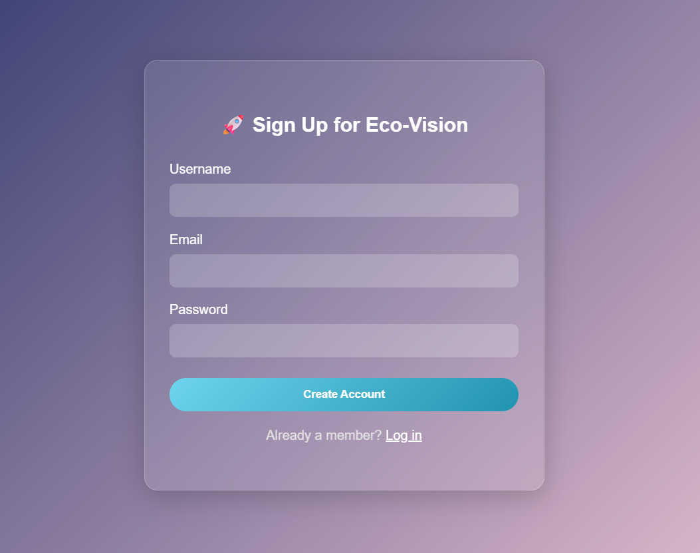
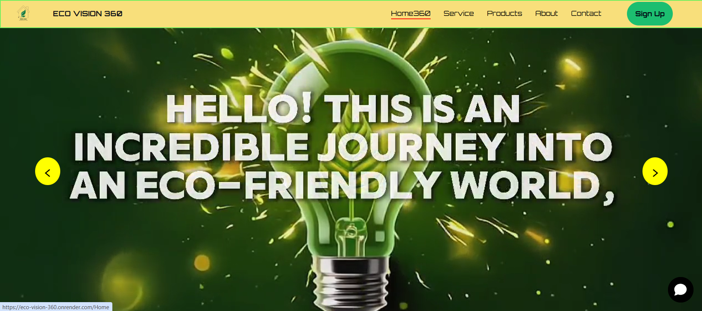
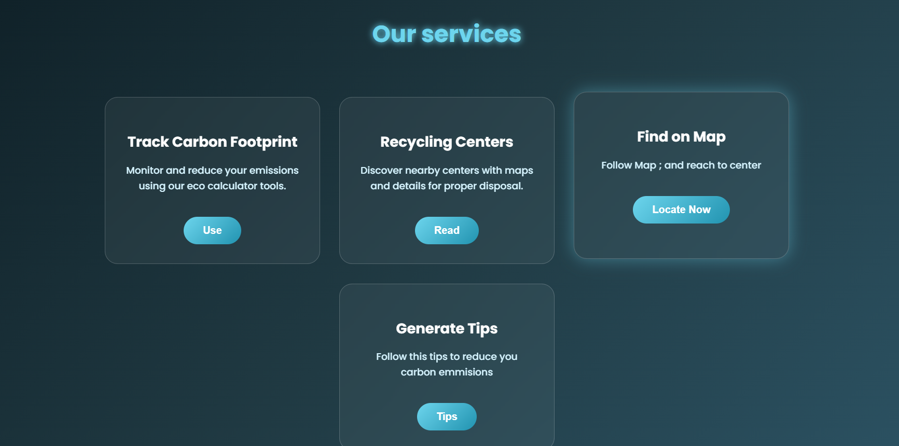
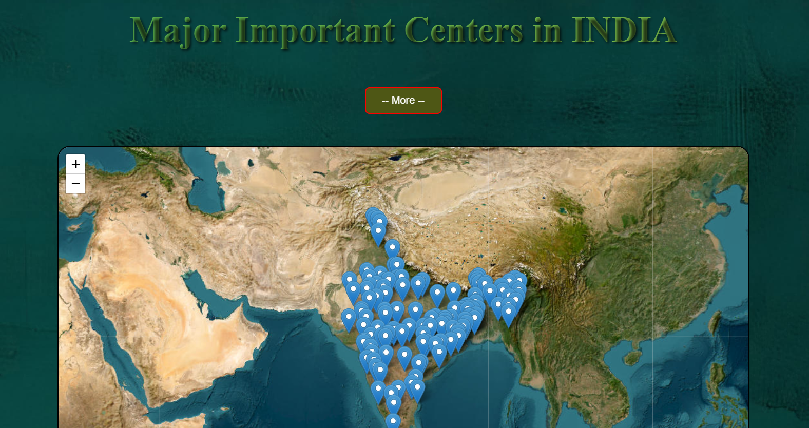
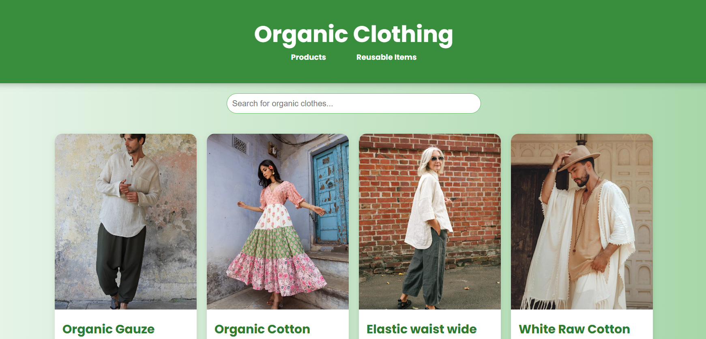
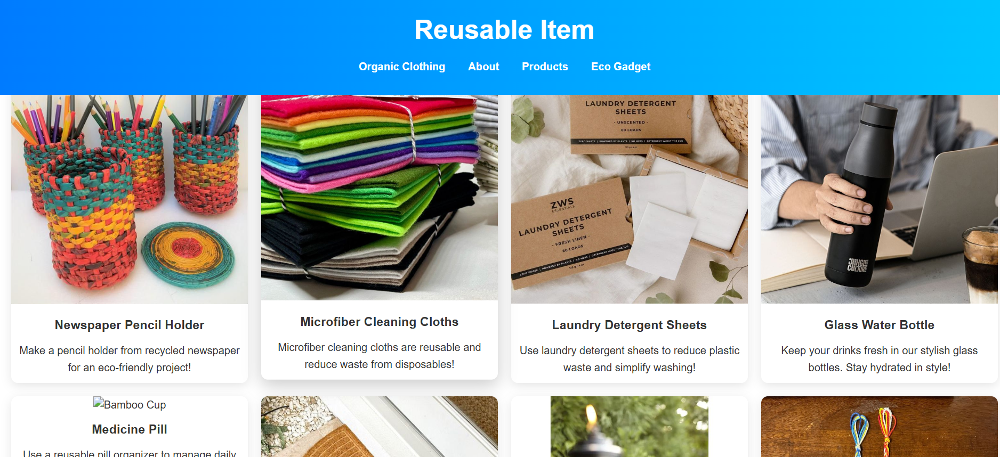
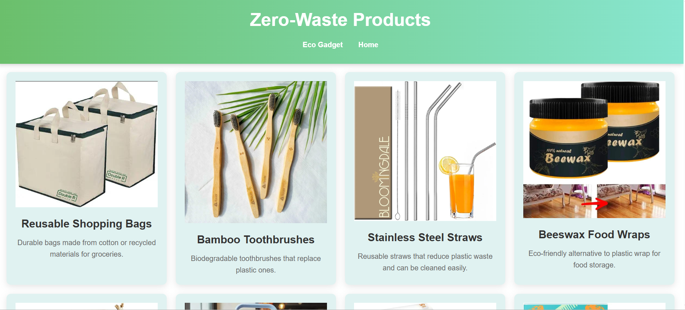

# 🌱 Eco-Vision-360 (v2.05)

A **full-stack MERN eco-awareness platform** with user authentication, database integration, and live deployment—built to promote sustainable living through technology.

---

## 🚀 Live Demo

👉 https://eco-vision-360.onrender.com/

---

## 🧠 About the Project

Eco-Vision-360 is an upgraded version of the original Eco-Vision platform.  
This version focuses on **real-world full-stack features**, including user login/authentication, database persistence, and backend deployment.

The goal is to combine **environmental awareness** with **practical web development skills**.

---

## ✨ Key Features

- 🔐 **User Authentication**
  - Secure login & registration
  - Session-based access control

- 🛒 **Eco-Friendly Store**
  - Curated eco-product showcase
  - Structured backend routing

- 📊 **Carbon Footprint Calculator**
  - Estimates environmental impact
  - Encourages sustainable habits

- ♻️ **Recycling Center Locator**
  - Educates users about recycling processes
  - Promotes responsible waste management

- 🗄️ **Database Integration**
  - Persistent user & app data using MongoDB

- 🌐 **Deployed Backend**
  - Live server with Express & Node.js

---

## 🖼️ Screenshots

🛠️ Tech Stack
**Frontend**
HTML5
CSS3
JavaScript
EJS (templating)
**Backend**
Node.js
Express.js
Database
MongoDB
Mongoose
Other
**Authentication & routing**
MVC-style project structure
├── models        # Database schemas

├── routes        # Express routes

├── views         # EJS templates

├── public        # Static assets (CSS, JS, images)

├── app.js        # Main server file

├── package.json

**Author** -Arko Bag
